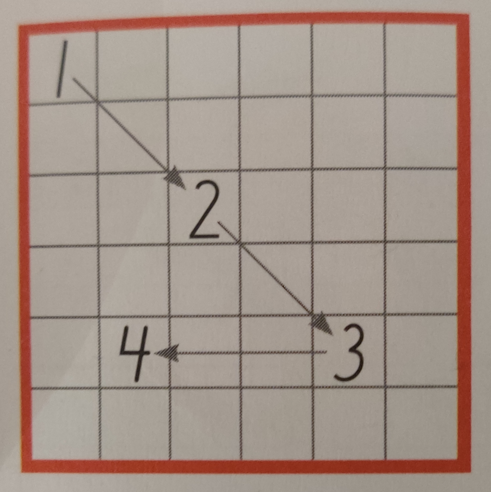

# solvers
Solvers to random problems

## Number sequence
Write number 1, 2, 3 and so on in the matrix, as far as possible
* You choose which element to start in
* You may move over two (2) squares horizontally or vertically or over one (1) square diagonally, see example below
* Follow the rules and try to fill in all numbers

The solver supports any size of matrix, with the caveat that solutions might not exist for a given size (or take very long time to find).
Typically all ~12K solutions to a 5x5 matrix are computed instantaneously, while all +2M solutions for a 6x6 matrix might take in the order of 30 minutes depending on hardware.

Sample output:

    $ python3 ./number_sequence_solver.py 6 6
    rate:          3.02e+06 moves/s   
    solutions so far: 57732
    ^C

    You pressed Ctrl+C!
    solutions so far: 58340
    last solution:
     1 23 12  2 22 36 
    33 26  7 34 27  8 
    11 14 29 24 13 30 
     6 20 17  3 21 35 
    32 25 10 31 28  9 
    18 15  5 19 16  4 
